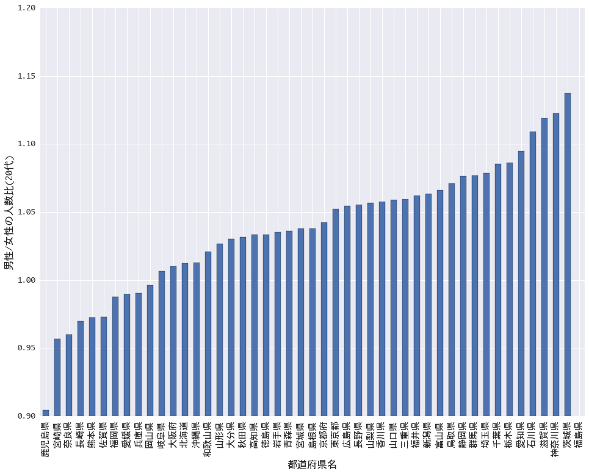
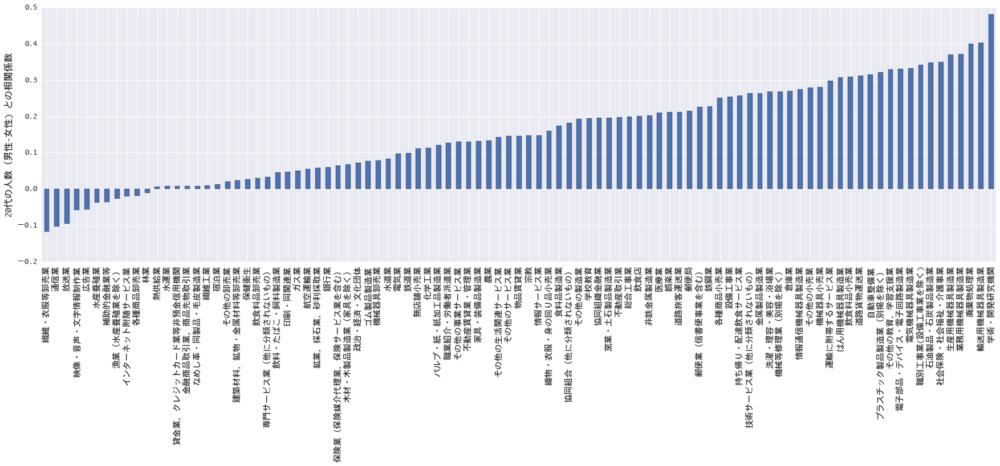
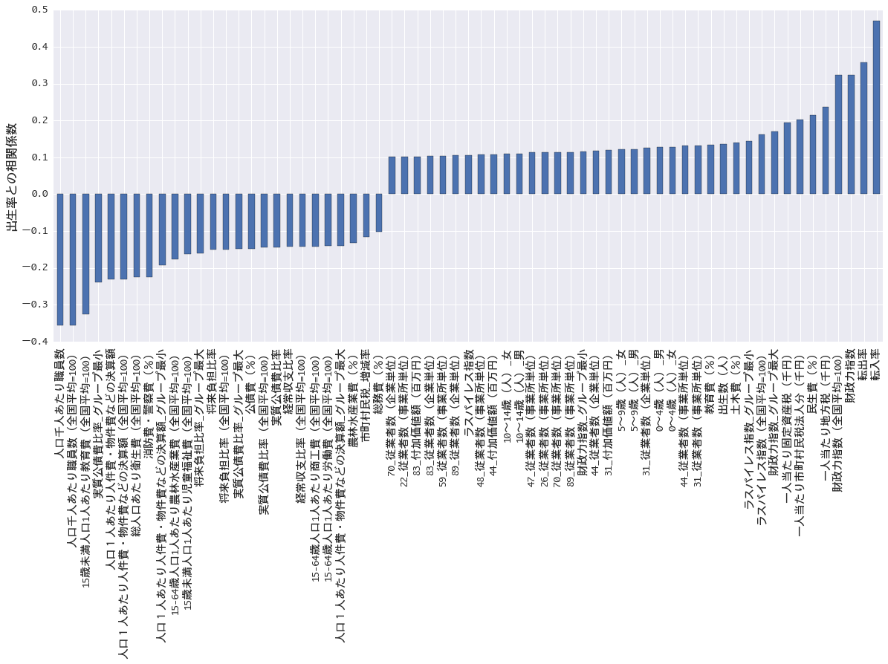

# 結婚出産に関する分析まとめ

-> オリジナルの分析結果は<a href='分析もろもろ.ipynb' /> jupyter notebook ファイル</a>を参照

## 都道府県間の20代男女比、最大で1.25倍
### 地域間の男あまり、女あまりの実態が明らかに
自治体オープンデータ（RESASデータ）によると、2015年段階で、都道府県間の20代の男性と女性の比率が最大で1.25倍強になることが判明した。

この結果から、そもそもの出会いの機会に地域間格差が、それが日本の低い結婚率に大きな影響を与えているのではないか (分析者談)。
もっとも20代の女性の割合が高かったのは鹿児島県で、20代男性の人数は20代女性の人数の0.90倍。逆に、もっとも20代の男性の割合が高かったのは茨城県の1.13倍だった。

*福島県はデータ欠損により調査対象外

### 産業構造による地域間男女比の発生
地域間での20代男女比の偏りが、その地域の産業構造に大きく起因することも、RESASデータの分析から明らかになった。

20代の人口が2,000人以上の自治体（865 地域）を対象に、その地域の業種ごとの従業員数と男女の人数差の関係性を分析した。
その結果、特に男性の人数がその地域の業種ごとの従業員数と大きく関連することがわかった。

特に、学術・研究機関や製造業、廃棄物処理業の従業員数が多い地域ほど、男性の数が多いことがわかった。
業種による男女比の偏りが若者の出会いの機会を奪っていることが、データからも明らかになった。

## 人の流動性が少子化問題の鍵 ~自治体オープンデータからの提言~
自治体オープンデータ（RESASデータ）の分析から、出生率と大きく関連する以外な要因が浮かび上がってきた。

20代の人口が2,000人以上の自治体（865 地域）を対象に、どの要因がその地域の出生率と大きく関連するかについて、省庁間の情報をまたいだ分析が行われた。その結果、出生率ともっとも大きく関連する要因は「転入率」で、ついで「転出率」、「財政力指標」だった。これらの要因は乳幼児の数に大きく影響を受ける「自治体の歳出の占める民生費」よりも関係が強く、健全な財政の他に、人の流動性に関連する要因が出生率に極めて重要であることがわかった。

なお、もっとも出生率とマイナスの関係にあったのは、「人口に占める地方自治体職員の割合」だった。

分析者からのコメント「出産のために引っ越しをする方も多いので、転入率が高くなることは予想できた。しかし、転出率が大きく関連していることは素直に驚きだ。活気がある地域とそうでない地域があるということかもしれない。活気がたりないと自治体職員の人数比が高くなるのではないか。各自治体への一層の努力が求められる結果といえそうだ。より深い分析のためには自治体のデータだけではなく、民間のデータ、例えば出会いを支援するWebサービスの行動情報などと結びつけて、人の行動まで踏み込んだ分析まで必要になりそうだ。」

